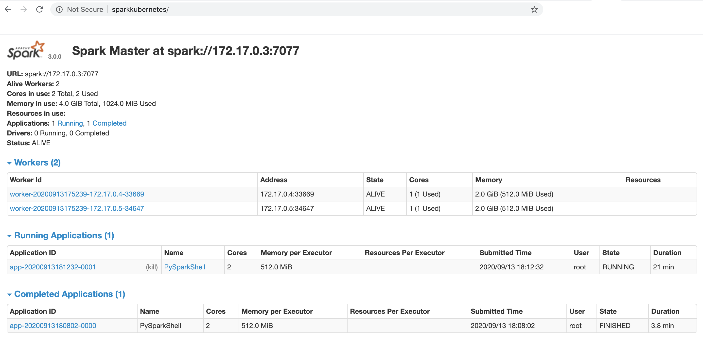
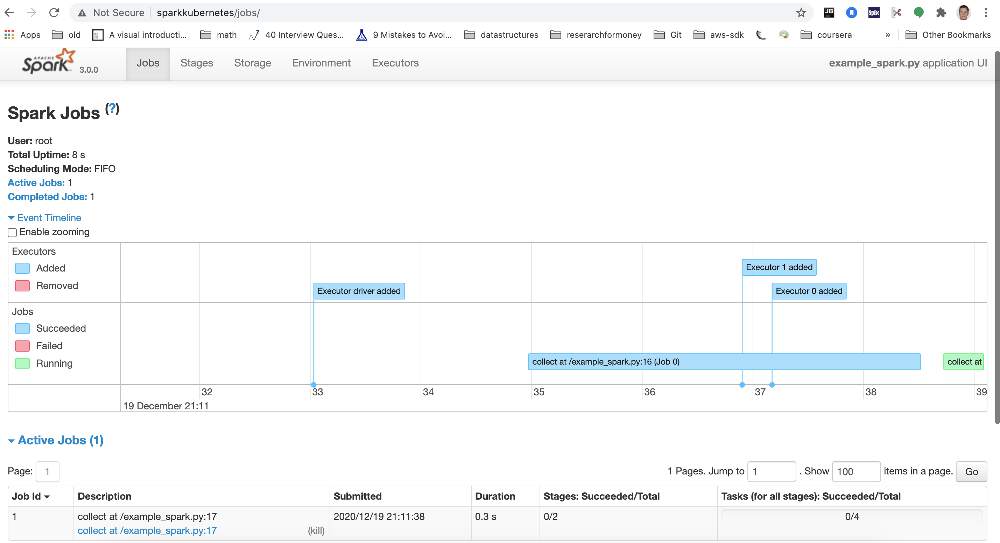

## Spark

I was inspired by this repository: https://github.com/testdrivenio/spark-kubernetes
However I have continued on the structure and made my own improvements.

### Docker

The container is available under `tools/docker/spark/Dockerfile`.

It contains:

* python3.9.1
* spark 3.0.1

The command `minikube docker-env` returns a set of bash environment variable exports to configure
your local environment to re-use the Docker daemon inside the Minikube instance.
```bash
eval $(minikube docker-env)
```

```bash
make build_spark_docker
```

Start `minikube`:
```bash
minikube start --memory 8192 --cpus 4 --vm=true
```

Enable `minikube` `dashboard`:
```bash
minikube dashboard
```

Tear up:
```bash
make deploy_spark_k8s_cluster
```

`I have for some reason noticed that it does not work when I do this in the script, so run this
stand alone for now!`

```bash
kubectl apply -f ./deploy/k8s/spark/minikube-ingress.yaml
```

Then run:

```bash
echo "$(minikube ip) sparkkubernetes" | sudo tee -a /etc/hosts
```

The `spark web ui` and `spark detailed web ui` can now be reached at:

[http://sparkkubernetes](http://sparkkubernetes/)



`NOTE! jobs will only be available while you run a spark job, access this while running example
code below, or simply run a pyspark shell interactively if there is a need to verify this`

`Example`

```bash
  |  ~/c/deiteo | on   DEITEO-001-F…To-Worker(s) !1 ▓▒░ kubectl get pods
NAME                           READY   STATUS    RESTARTS   AGE
spark-worker-cb4fc9c8d-fhsxh   1/1     Running   0          53m
sparkmaster-cccbbdfcd-qktwq    1/1     Running   0          54m
>>
```

```bash
kubectl exec sparkmaster-cccbbdfcd-b7g2d -it -- spark-submit example_spark.py --config deiteo.yaml --local False
```

[http://sparkkubernetes/jobs](http://sparkkubernetes/jobs)



To tear down run:
```bash
make delete_spark_k8s_cluster
```
